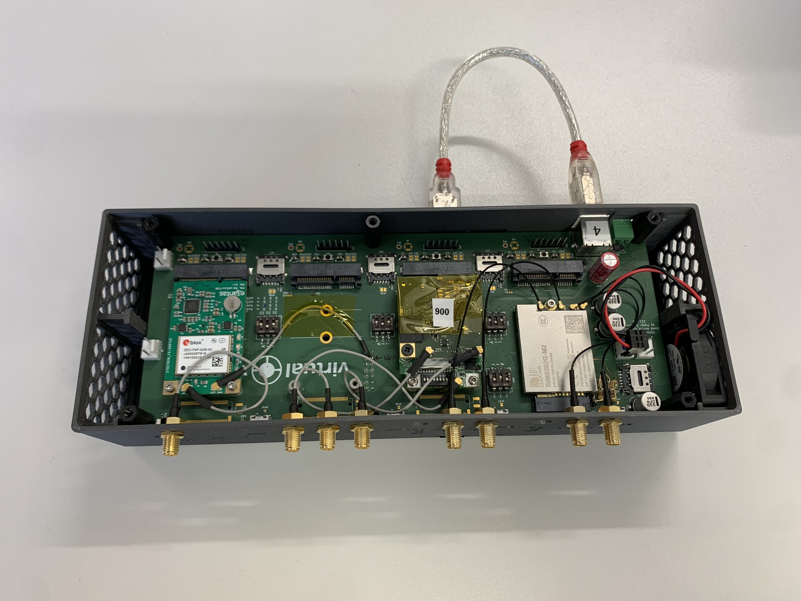
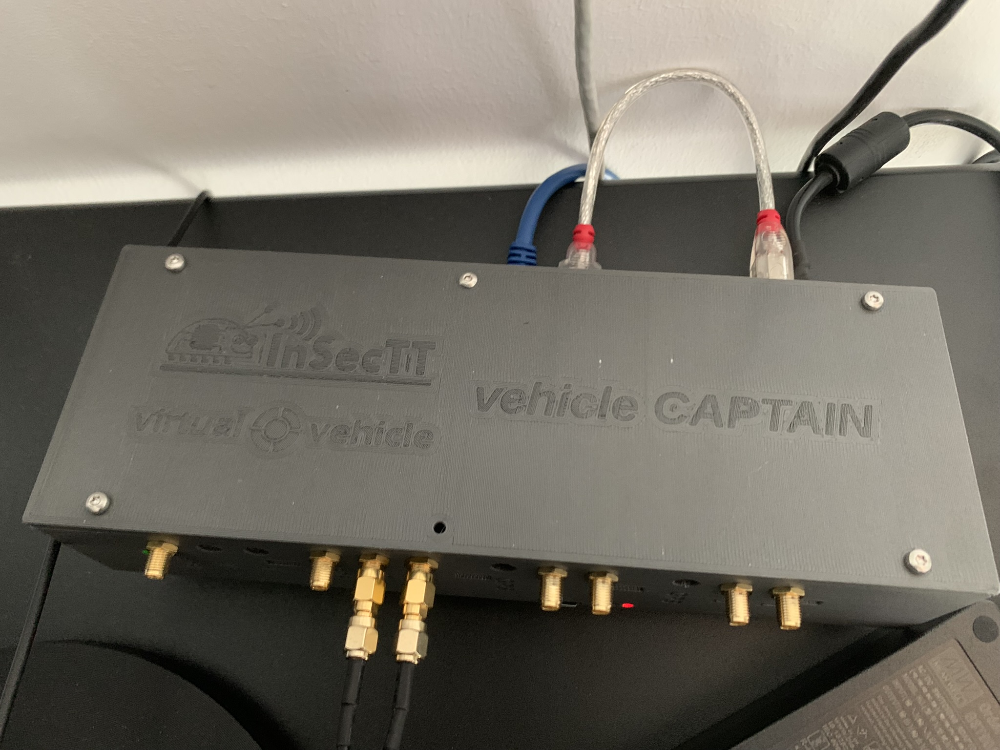

# vehicleCAPTAIN - Hardware
You may use any hardware you already have. Most components of the [vehicleCAPTAIN](https://github.com/virtual-vehicle/vehicle_captain) toolbox can be fit independent of hardware.

## Recommendation
If you are interested in acquiring a development platform from [us](https://www.v2c2.at/), please contact our hardware expert [Peter Sammer](https://github.com/solderdev).

[Our](https://www.v2c2.at/) projects use the following hardware configurations.

### vehicleCAPTAIN - mPCI-E/M.2 Quad Expander
We designed a platform that can host up to four mPCI-E/M.2 modules simultaneously via a USB hub.

The Quad Expander is controlled by a Raspberry Pi 4, which is running the [routing core](https://github.com/virtual-vehicle/vehicle_captain_routing_core).

### vehicleCAPTAIN - Demo Board
The demo board allows to host one mPCI-E or one M.2 module

### Unex SOM301-E
[Unex](https://www.unex.com.tw/) provides system-on-modules (SOMs) for V2X communication.

Advantages:
- one software library for sending and receiving
- one software library for decoding and encoding of msgs
- cheap compared to fully implemented competitors
- access to most parts of the software stack

Disadvantages:
- precompiled libraries only (no 64bit support)
- limited amount of BTP ports 
- propretary standard for power (small mPCI-E adapter needed)
