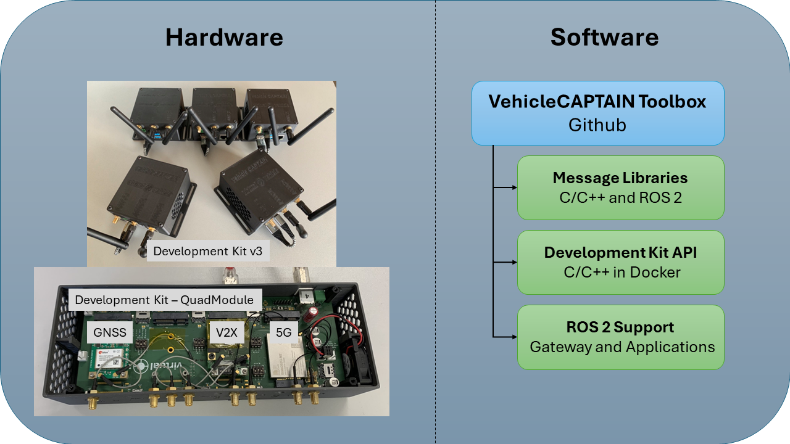

# The vehicleCAPTAIN toolbox
The vehicle communication platform to anything (vehicleCAPTAIN) toolbox is a collection of software to enable a quick entry into the vehicle-to-everything (V2X) domain.

For a quick start we also provide suggestions for [hardware](HARDWARE.md).

## Repositories
The vehicleCAPTAIN toolbox is structured into the following components:

- ITS Message Libraries (with ETSI source)
  - [vcits](https://github.com/virtual-vehicle/vehicle_captain_its_lib_c_cxx):
      is a C/C++ library autogenerated with the [asn1c](https://github.com/vlm/asn1c) compiler from [ETSI sources](https://forge.etsi.org/rep/ITS/asn1).
- Platform
  - [Routing Core](https://github.com/virtual-vehicle/vehicle_captain_routing_core):
    is a program that can support multiple V2X hardware components with only one interface.
    (Release Expected Q3 2023)
  - [Receiver Example](https://github.com/virtual-vehicle/vehicle_captain_routing_receiver_example):
    is a receiver example for the routing software.
  - [Sender Example](https://github.com/virtual-vehicle/vehicle_captain_routing_sender_example):
    is a sender example for the routing software.
- ROS2 Support
  - [ROS2 ITS Messages](https://github.com/virtual-vehicle/v2x_msgs):
    is a library autogenerated from [ETSI](https://forge.etsi.org/rep/ITS/asn1) sources for ROS2.
  - [ROS2 V2X Gateway](https://github.com/virtual-vehicle/v2x_gw):
    is a translator for asn1 messages to ROS2 type messages.
- Tools
  - [asn1 parser](https://github.com/virtual-vehicle/vehicle_captain_asn1_parser):
    is a fork of a specific [asn1c](https://github.com/brchiu/asn1c/tree/velichkov_s1ap_plus_option_group_plus_adding_trailing_ull) implementation, to autogenerate ROS2 messages from [ETSI](https://forge.etsi.org/rep/ITS/asn1) sources.

## Copyright
Please cite the [vehicleCAPTAIN](https://github.com/virtual-vehicle/vehicle_captain/blob/main/LITERATURE.md) if you used any part of this software toolbox for your work.

The software parts themselves are managed by FOSS licenses in the specific repositories.

## Contribution Guidelines
Feel free to add fixes and new features to the specific repositories.

## Authors
Please find contact information in the corresponding repositories.

## Acknowledgement
The majority of this work is part of my ([Christoph Pilz](https://www.researchgate.net/profile/Christoph-Pilz)) PhD studies at [Graz University of Technology](https://www.tugraz.at/home) in cooperation with the [Virtual Vehicle Research GmbH](https://www.v2c2.at/). Features are integrated across various projects.

Contributions received funding by the following parties:

### Austria - COMET K2
The work was written at [Virtual Vehicle Research GmbH](https://www.v2c2.at/) in Graz and partially funded by the COMET K2 Competence Centers for Excellent Technologies from the Austrian Federal Ministry for Climate Action (BMK), the Austrian Federal Ministry for Digital and Economic Affairs (BMDW), the Province of Styria (Dept. 12) and the Styrian Business Promotion Agency (SFG). The Austrian Research Promotion Agency (FFG) has been authorised for the programme management.

### 5G Carmen
[5G-CARMEN](https://5gcarmen.eu/) has received funding from the European Union’s Horizon Europe research and innovation programme under grant agreement No. 825012. 5G-CARMEN project provides a cooperative, connected and automated mobility (CCAM) platform leveraging the most recent 5G advances and enabling vehicles to exchange speed, position, intended trajectories and manoeuvres by exploring distributed and centralised approaches for cooperative lane merging. 5G-CARMEN will realise a 5G-enabled corridor from Germany via Austria to Italy for testing automated driving functions across borders.
The work reflects only the author's view and the Commission is not responsible for any use that may be made of the information it contains.

### InSecTT
[InSecTT](www.insectt.eu) has received funding from the ECSEL Joint Undertaking (JU) under grant agreement No 876038. The JU receives support from the European Union's Horizon 2020 research and innovation programme and Austria, Sweden, Spain, Italy, France, Portugal, Ireland, Finland, Slovenia, Poland, Netherlands, and Turkey.
The work reflects only the author's view and the Commission is not responsible for any use that may be made of the information it contains.

### SELFY
[SELFY](https://selfy-project.eu/) has received funding from the European Union’s Horizon Europe research and innovation programme under grant agreement No 101069748.
This work reflects only the author's view. Neither the European Commission nor the CINEA is responsible for any use that may be made of the information it contains.

### SHOW
[SHOW](https://show-project.eu/) has received funding from the European Union’s Horizon Europe research and innovation programme under grant agreement No. 875530. The project deploys a fleet of 74 AVs of all types including buses, taxis, MaaS connected automated cars and cargo vehicles for all transport users in both mixed traffic and dedicated lines operating under traffic speeds ranging from 18 to over 50km/h, also with integrated C-ITS functionality as an essential component for data exchange.
The work reflects only the author's view and the Commission is not responsible for any use that may be made of the information it contains.

