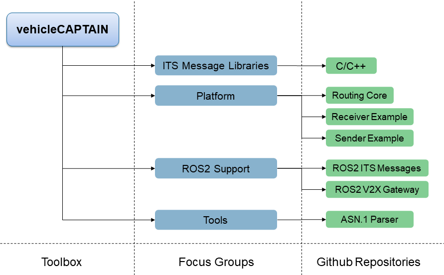

# The vehicleCAPTAIN toolbox
The <u>vehicle</u> <u>c</u>ommunic<u>a</u>tion <u>p</u>latform <u>t</u>o <u>a</u>nyth<u>in</u>g (vehicleCAPTAIN) toolbox is a combination of hardware and software for a quick entry in the vehicle-to-everything (V2X) communication domain.

The hardware is discussed [here](HARDWARE.md).

The software is split into several repositories, as listed below.

## Repositories
The vehicleCAPTAIN toolbox is structured into the following components:

- ITS Message Libraries (with ETSI source)
  - [vcits](https://github.com/virtual-vehicle/vehicle_captain_its_lib_c_cxx):
      is a C/C++ library autogenerated with the [asn1c](https://github.com/vlm/asn1c) compiler from [ETSI sources](https://forge.etsi.org/rep/ITS/asn1).
- Platform
  - [Routing Core](https://github.com/virtual-vehicle/vehicle_captain_routing_core):
    is a program that can support multiple V2X hardware components with only one interface.
    (Release Expected Q4 2023)
  - [Receiver Example](https://github.com/virtual-vehicle/vehicle_captain_routing_receiver_example):
    is a receiver example for the routing software.
  - [Sender Example](https://github.com/virtual-vehicle/vehicle_captain_routing_sender_example):
    is a sender example for the routing software.
- ROS2 Support
  - [ROS2 ITS Messages](https://github.com/virtual-vehicle/v2x_msgs):
    is a library autogenerated from [ETSI](https://forge.etsi.org/rep/ITS/asn1) sources for ROS2.
  - [ROS2 V2X Gateway](https://github.com/virtual-vehicle/v2x_gw):
    is a translator for asn1 messages to ROS2 type messages.
- Tools
  - [asn1 parser](https://github.com/virtual-vehicle/vehicle_captain_asn1_parser):
    is a fork of a specific [asn1c](https://github.com/brchiu/asn1c/tree/velichkov_s1ap_plus_option_group_plus_adding_trailing_ull) implementation, to autogenerate ROS2 messages from [ETSI](https://forge.etsi.org/rep/ITS/asn1) sources.

## Copyright
Please cite the [vehicleCAPTAIN toolbox](https://github.com/virtual-vehicle/vehicle_captain/blob/main/LITERATURE.md) if you used any part of this software toolbox for your work.

The software parts themselves are managed by FOSS licenses in the specific repositories.

## Contribution Guidelines
Feel free to add fixes and new features to the specific repositories.

## Authors
Please find contact information in the corresponding repositories.

## Acknowledgement
The majority of this work is part of my ([Christoph Pilz](https://www.researchgate.net/profile/Christoph-Pilz)) PhD studies at [Graz University of Technology](https://www.tugraz.at/home) in cooperation with the [Virtual Vehicle Research GmbH](https://www.v2c2.at/). Features are integrated across various projects.
